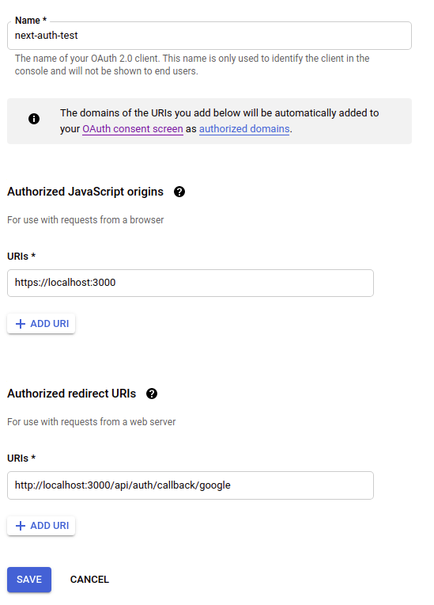

# GOOGLE OAUTH (AGAIN WE ARE DOING THIS ONLY FOR DEVELOPMENT; NEW SETTINGS WOULD BE NEEDED FOR PRODUCTION PP)

OPEN GOOGLE CLOUD DASBOARD

CREATE NEW PROJECT (YOU ARE ALLOWWED 11 FREE PROJECTS)

# ONLY ONCE WE NEED TO DEFINE `OAuth Consent Screen` (SO SERCH FOR THAT AND OPEN IT)

IN SECTION AUTHORIZED DOMAINS

I SETTED <http://localhost:3000/blog> AS `Application home Page`

THE REST OF THE REQUIRED THINGS YOU NEED TO SETUP ARE OAUTS NEME AND YOUR EMAIL

CREATE CONSENT SCREEN

# NOW WE ARE CREATING ACTUAL OAUTH APP SO SEARCH FOR `Credentials`

CLICK ON `+ CREATE CREDENTIALS`

PICK `OAuth Client Id`

**THE MOST IMPORTANT THING TO SET IS `AUTHORIZED REDIRECT URIs`**

THAT SHOULD BE <http://localhost:3000/api/auth/callback/google>



# YOU NEED TO COPY CLIENT ID AND A CLIENT SECRET AND SET IT INSIDE YOUR `.env.local` FILE

IF YOU CANT FIND THEM, AGIN SEARCH FOR CREDENTIALS, AND THERE YOU WILL SE LISTED YOUR OAUTH APP, CLICK ON IT

**IN THE RIGHT TOP CORNER YOU CAN FIND CLIENT ID AND SECRET**

LETS SEET THEM AS A ENV VARIABLES

```
code .env.local
```

```bash

# ADDED THESE
GOOGLE_CLIENT_ID=
GOOGLE_CLIENT_SECRET=
```
