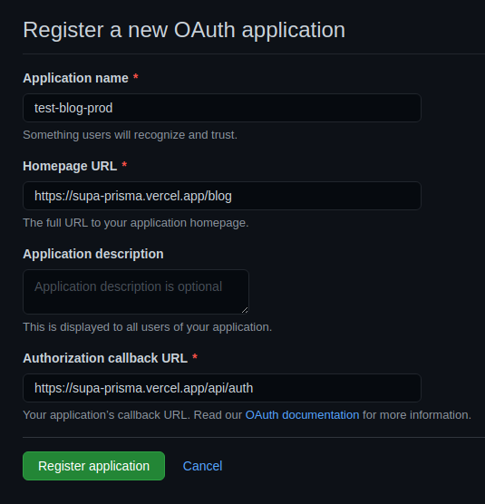
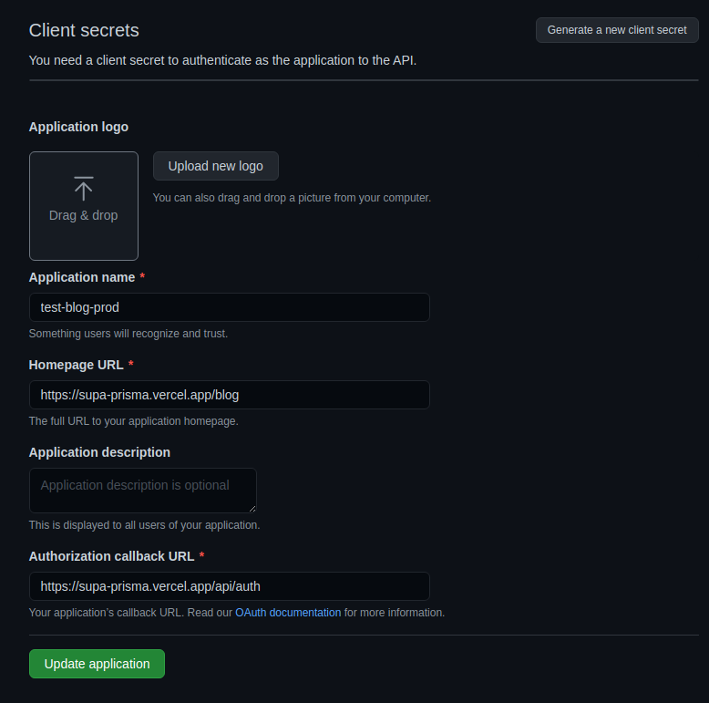

# DEPLOYMENT AND OAUTH APPS FOR PRODUCTION

LETS START BY MAKING AND TRYING OUT PRODUCTION BUILD

```
yarn build
```

```
yarn start
```

**EVERYTHING SEEMS TO WORK PROPERLY**

## LET'S START WITH DEPLOYMENT

```
vercel
```

I MENAGED TO MADE DEPLOYMENT BUT SINCE ENV VARIABLES ARENT LOADED I HAD FAILED START

I DELETED THAT DEPLOYMENT (I AM TALKING ABOUT JUST DEPLOYMENT **DONT GO INTO VERCEL TO DELETE ENTIRE PROJECT INSTED**)

JUST DELETE DEPLOYMENT THAT IS I GUEESS PREVIEW ONE

## SET SOME ENV VARIABLES

SET THOSE SUPABASE (DATBASE URLS, SECRETS AND CLIENT THINGS)

TREY TO RUN VERCEL AGAINE

```
vercel
```

OK, I HAVE DEPLOYMENT THAT DIDN'T FAILED STARTING (DODN'T FAILED `next start` BECAUSE SOME CRUCIAL ENV VARIABLES ARENT BREAKING ANYTHING)

**AND I HAVE URL**

<https://supa-prisma.vercel.app>

## SET NEXT AUTH URL AS EN VARIABLE

SET THET ON VERCEL AS ENV VARIABLE WHERE IT'S NEEDED

YOU NEED `NEXTAUTH_URL` AS `https://supa-prisma.vercel.app/api/auth`


## NOW LET'S GO AND GENERATE PRODUCTION OAUTH APP

### GITHUB

`Settings` --> `Developer Settings` --> `OAuthApps` --> `New OAuth App`



GENERATE SECRET



COPY SECRET AND CLIENT ID

IN VERCEL DASBOARD SET VARIABLES

`GITHUB_SECRET` AND `GITHUB_ID`

OK NOW, TRY TO REDEPLOY (YOU CAN ADD A COMMEN IN YOUR CODEBASE JUST TO BE SINGNALED THAT SOMETHING CHANGED AND THAT REDEPLOYMENT WOULD ACTUALLY EXECUTE)

```
vc
```
