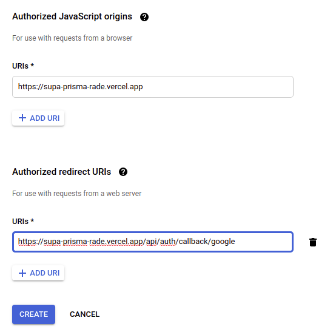

# DEPLOYMENT AND OAUTH APPS FOR PRODUCTION

LETS START BY MAKING AND TRYING OUT PRODUCTION BUILD

```
yarn build
```

```
yarn start
```

**EVERYTHING SEEMS TO WORK PROPERLY**

## LET'S START WITH DEPLOYMENT

```
vercel
```

I MENAGED TO MADE DEPLOYMENT BUT SINCE ENV VARIABLES ARENT LOADED I HAD FAILED START

I DELETED THAT DEPLOYMENT (I AM TALKING ABOUT JUST DEPLOYMENT **DONT GO INTO VERCEL TO DELETE ENTIRE PROJECT INSTED**)

JUST DELETE DEPLOYMENT THAT IS I GUEESS PREVIEW ONE

## SET SOME ENV VARIABLES

SET THOSE SUPABASE (DATBASE URLS, SECRETS AND CLIENT THINGS)

TREY TO RUN VERCEL AGAINE

```
vercel
```

OK, I HAVE DEPLOYMENT THAT DIDN'T FAILED STARTING (DODN'T FAILED `next start` BECAUSE SOME CRUCIAL ENV VARIABLES ARENT BREAKING ANYTHING)

**AND I HAVE URL**

IT SHOULD BE LIKE THIS

<https://supa-prisma-rade.vercel.app> (I THINK THERE ARE COUPLE OF URLS BUT YOU CAN WORK WITH THIS)

## SET NEXT AUTH URL AS EN VARIABLE

SET THET ON VERCEL AS ENV VARIABLE WHERE IT'S NEEDED

YOU NEED `NEXTAUTH_URL` AS `https://supa-prisma-rade.vercel.app/api/auth`


## NOW LET'S GO AND GENERATE PRODUCTION OAUTH APP

### GITHUB

`Settings` --> `Developer Settings` --> `OAuthApps` --> `New OAuth App`


PS. I THINK IT WAS IN VAIN TO SET UP /blog ON UPPER LINK (IT'S JUST NOT IMPORTANT)

NOW GENERATE SECRET

COPY SECRET AND CLIENT ID

IN VERCEL DASBOARD SET VARIABLES

`GITHUB_SECRET` AND `GITHUB_ID`

OK NOW, TRY TO REDEPLOY (YOU CAN ADD A COMMEN IN YOUR CODEBASE JUST TO BE SINGNALED THAT SOMETHING CHANGED AND THAT REDEPLOYMENT WOULD ACTUALLY EXECUTE)

```
vc
```

I THEN WENT ON

<https://supa-prisma-rade.vercel.app/blog>

I TRIED TO LOGIN WITH GITHUB AND IT SEEMS TO WORK

### GOOGLE

LETS GO TO A GOOGLE CLOUD CONSOLE ,SEARCH FOR `Credentials`

PRESS ON `+ CREATE CREDENTIALS` --> `Create OAuth Client ID`

I SETTED LIKE THIS



COPY SECRET AND CLIENT ID, AND SET THEM AS `GOOGLE_CLIENT_ID` AND `GOOGLE_CLIENT_SECRET` IN VERCELS DASHBOARD

OK, AGAIN PUT SOME COMMENTS INSIDE CODEBASE AND DEPLOY AGAIN

```
vc
```