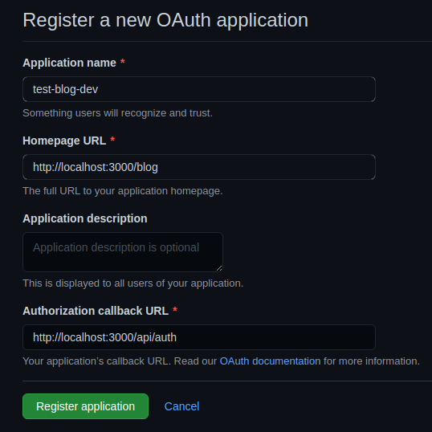

# GITHUB OAUTH

FIRST LETS OAUTH APPLICATION ON GITHUB

`Settings -> Developer Settings -> OAuth Apps -> New Oauth App -> Register a new application`

MOST IMPORTAN THING IS `Authorization Callback Url` YOU NEED TO PROVIDE

WE WILL SET:

<http://localhost:3000/api/auth>

BECAUSE THET IS REQUIRED FROM NET AUTH

WE CAN SET WHAT EVER WE WANT FOR THAT (**BUT JUST SET THAT TO BE SOME URL OF YOUR APP**)



***

**WHY I SETTED HOMPAGE URL TO BE <http://localhost:3000/blog>**? 

(**THIS IS WRONG HAS NO EFFECT**)

BECAUSE AFTER SUCCESSFULL SIGNING WITH GITHUB, USER SHOULD BE REDIRECTED TO THAT URL, **AND I WANT TIT TO BE /blog BECAUSE WE WERE USING OTHER PATHS EARLIER WHEN WE WERE LEARNING SOMETHING DIFFRENT AS YOU REMEMBER (I DON'T WANT TO REMOVE THOSE PATHS OR TO ALTER CODE IN THEM, YOU CAN THINK OF /blog AS COMPLETELY DIFFERENT APP WE ARE DEVELOPING)**

***

## AS YOU CAN CONCLUDE, THIS IS GITHUB OAUTH ONLY FOR DEVELOPMENT SINCE WE ARE USING AUTHORIZATION CALLBACK URL THAT IS TIED TO OUR LOCALHOST WHERE DEVELOPMENT APP IS SERVED

WHEN WE PUSH TO PRODUCTION WE NEED COMPLETELY NEW GITHUB OAUTH APP

AND AS YOU CAN SEE CALLBACK POINTS TO THE /api/auth WHERE WE ARE GOING TO IMPLEMENT NEXT-AUTH


## NOW WE NEED TO GENERATE SECRET FOR OUR GITHUB OAUTH APP WE JUST MADE

CLICK ON THE APP IF IT IS NOT OPENED TO YOU AND CLICK ON `Generate New Secret`


**AS YOU CAN SEE ABOVE, YOU CAN SETUP IMAGE (LOGO OF YOUR OAUTH APP) TOO (WE ARE NOT GOING TO DO THAT BUT NOW YOU KNOW WHERE TO SET THAT TOO (WHICH YOU WOULD PROBABLY DO WHEN PUSHIING TO PRODUCTION))**

WE GENERATED NEW SECRET, AND WE ARE ADDING THESE THRE TO OUR ENV VARIABLES

```
code .env.local
```

```c#
# GITHUB OAUTH
GITHUB_SECRET=
GITHUB_ID=
// URL FOR NEXT_AUTH (YOU SPECIFIED THIS IN GITHUB OAUTH APP TOO AS YOU REMEMBER)
NEXTAUTH_URL=http://localhost:3000/api/auth
```
